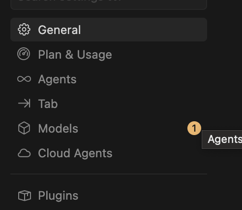
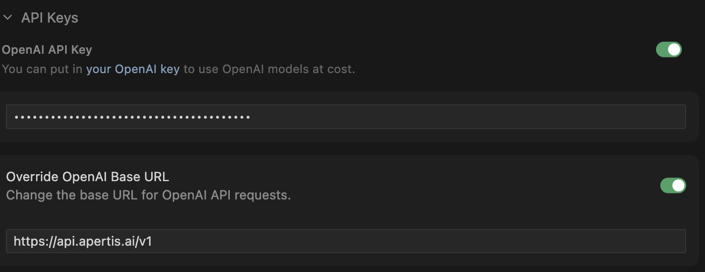

#  Cursor IDE

## Using Apertis Models

### Setting Up API Key

You can integrate **Apertis** into **Cursor** to use its models.

1. Open Cursor Settings and navigate to the **Models** section from the sidebar.



2. Scroll down to the **API Keys** section. In the **OpenAI API Key** field, enter your Apertis API Key. Enable the **Override OpenAI Base URL** toggle and enter the following URL:

```
https://api.apertis.ai/v1
```



### Enabling Models

After configuring the API Key, enable the models you want to use by toggling them on in the Models list. The available models through Apertis include:

- **Sonnet 4.6** — Claude Sonnet 4.6
- **Opus 4.6** — Claude Opus 4.6
- **GPT-5.3 Codex** — OpenAI GPT-5.3 Codex
- **GPT-5.4** — OpenAI GPT-5.4


For the full list of supported models, refer to the [Model Support List](https://apertis.ai/models).

:::tip Subscription Plans
If you are using an Apertis **Subscription Plan**, the models included in your plan are pre-configured. You can view and manage your subscription-supported models at [Apertis Settings → Models](https://apertis.ai/setting?tab=models).
:::

Once enabled, the models will be available in the chat and composer interfaces.
